# SirisPos v3: Advanced POS Software Solution

## Overview

SirisPos v3 is a comprehensive Point of Sale (POS) system designed for modern businesses, offering a wide range of features tailored to enhance efficiency, usability, and insights into business operations. This software streamlines tasks for both managers and employees by integrating several key functionalities:

### Features

- **Account Management**: Effortlessly handle multiple accounts with detailed access controls, ensuring streamlined workflows for users at every level.
  
- **Geolocation Tools**: Integrate location-based services to monitor deliveries, optimize routes, or visualize business trends based on geographic data.
  
- **Messaging Platform**: Stay connected with integrated messaging capabilities for communication between staff members or with customers, enabling real-time collaboration.
  
- **Advanced Statistical Tools**: Make informed decisions using built-in analytics and statistical tools to generate insights on sales performance, customer behavior, and more.

## Technologies

- Developed using **Flutter** for a seamless and responsive user interface.
- Backed by **Firebase** for real-time data sync and secure authentication.
- Harnesses the power of **NoSQL** databases for flexible data management.

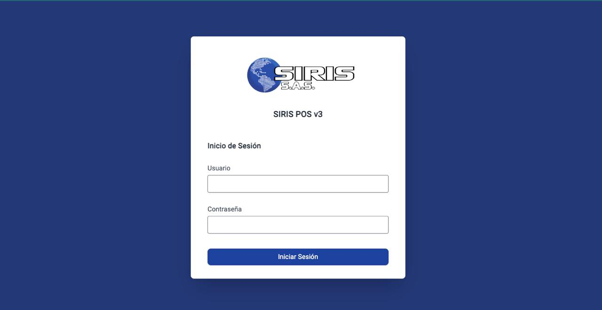

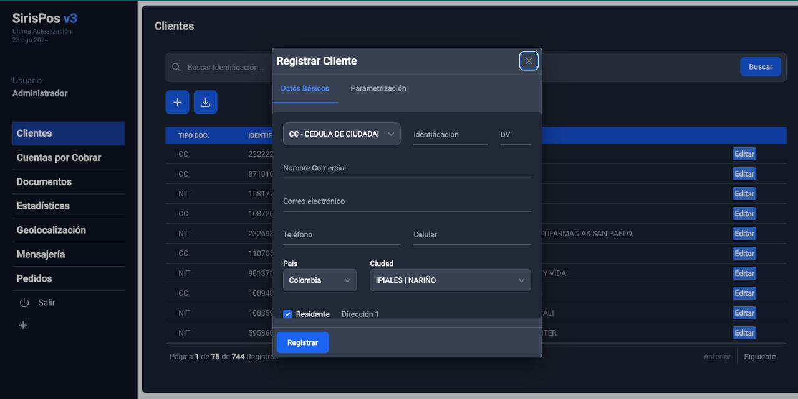
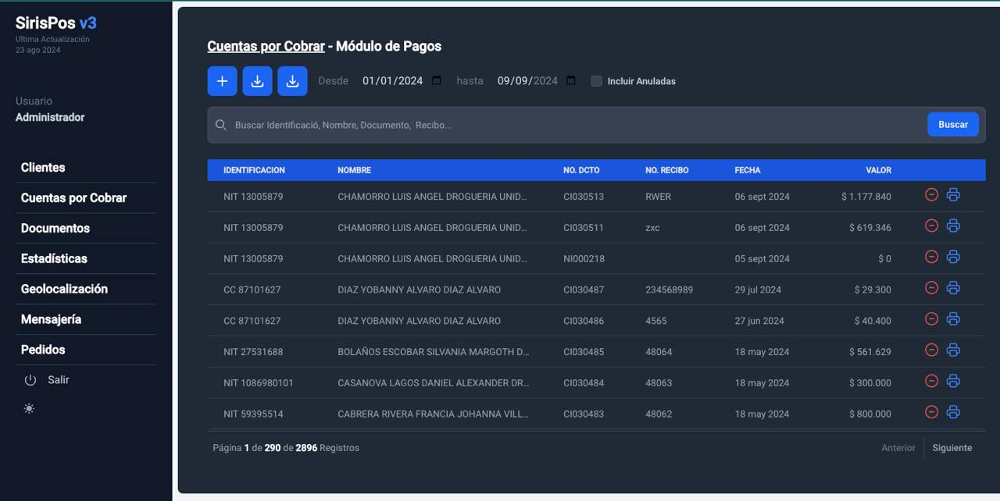
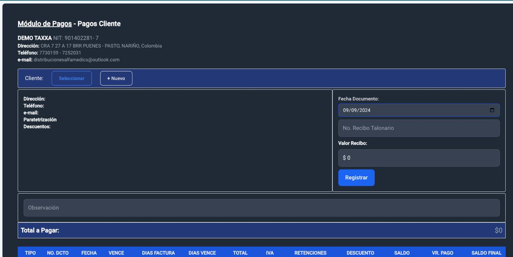
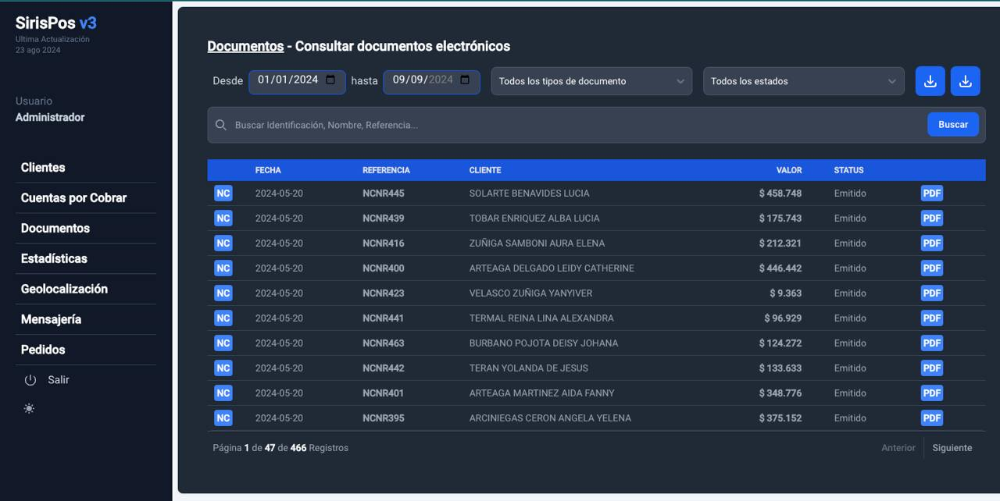
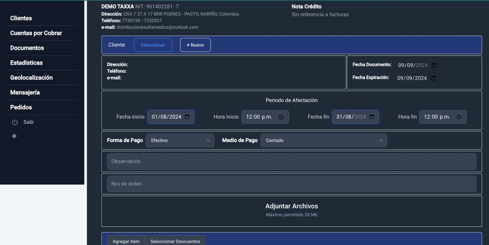
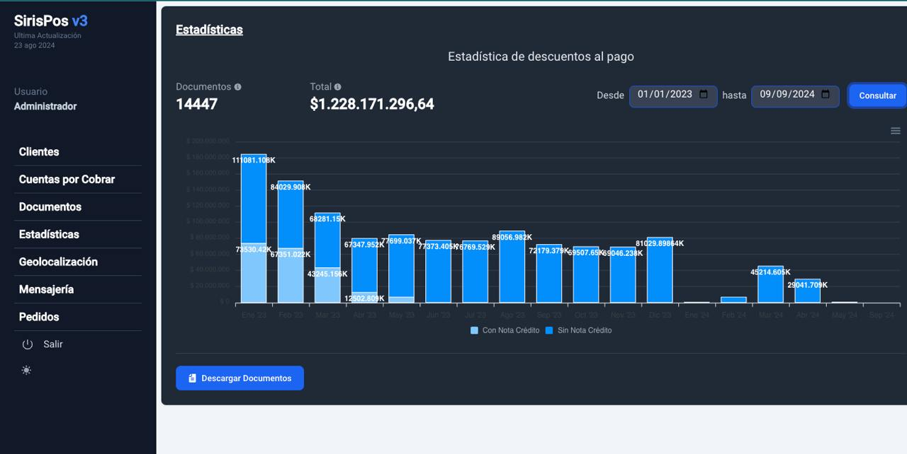
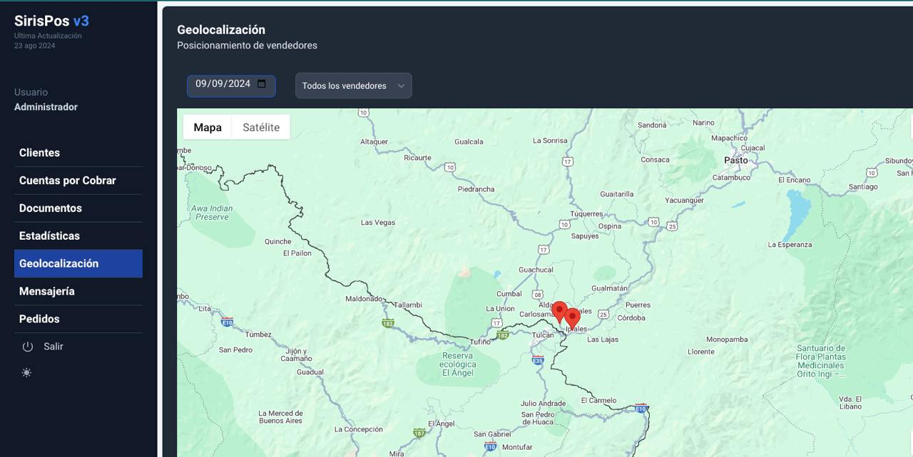
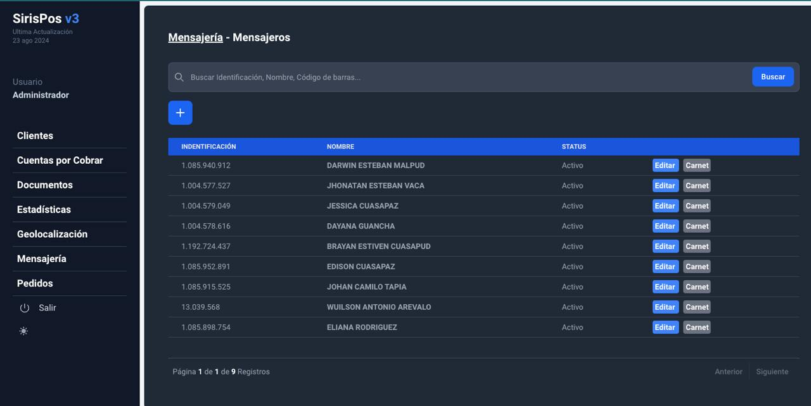
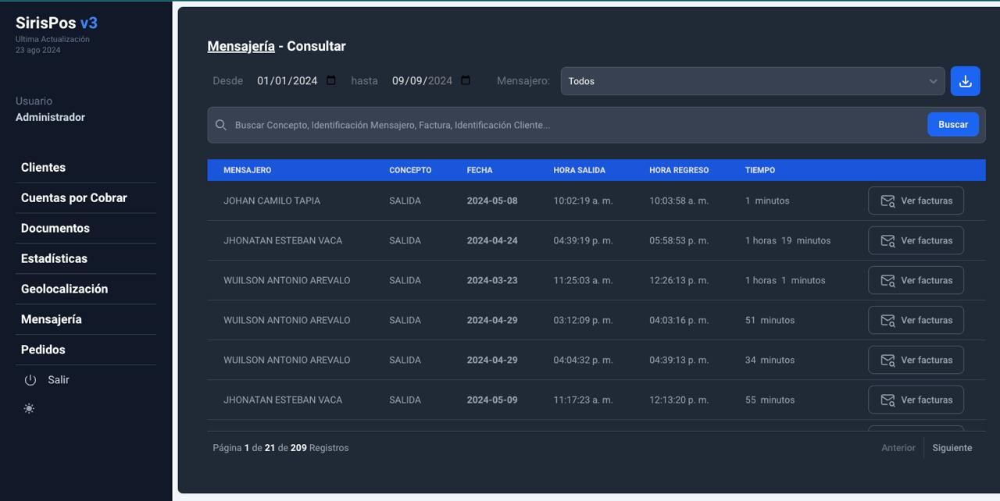
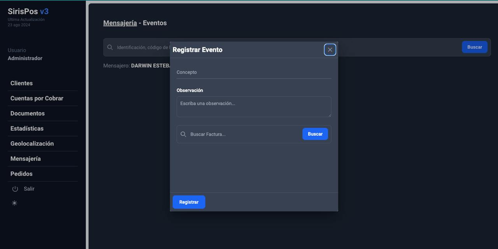
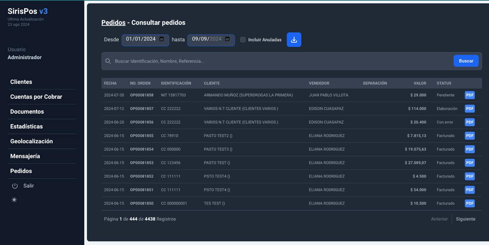
